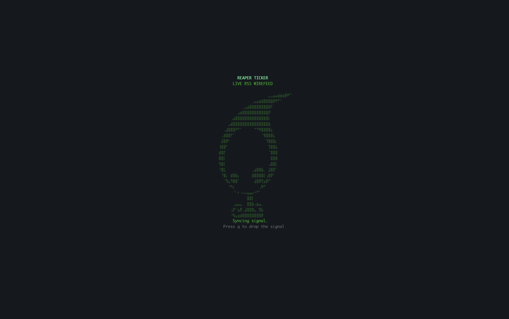
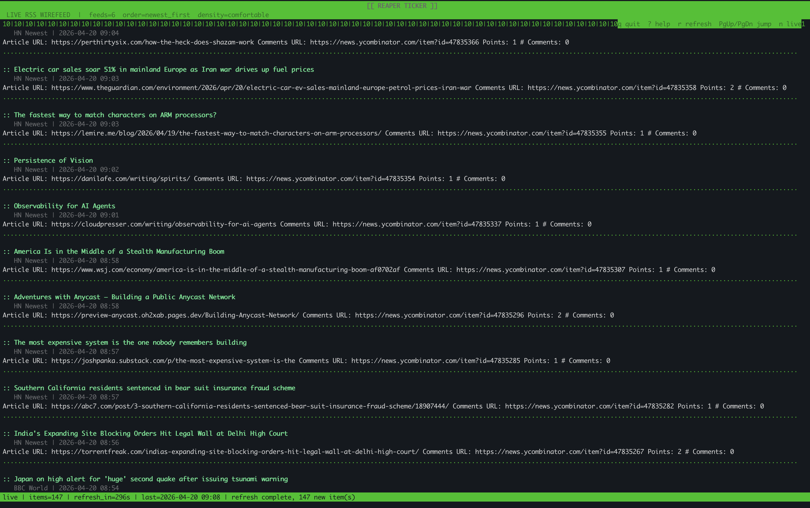

# Reaper Ticker

<p align="center">
  
</p>

<p align="center">
  A clean terminal RSS and Atom ticker with live scrolling, keyboard navigation, and fast multi-feed setup.
</p>

Reaper Ticker is for people who want a simple news wire in the terminal without a bloated reader, sync service, or browser tab farm. It pulls multiple feeds, merges them into one time-ordered stream, and keeps the UI focused on reading.

## Why This Exists

Most RSS tools are either heavy, old, or trying to do too much. Reaper Ticker aims for a narrower target:

- one terminal window
- one merged feed
- clear keyboard controls
- readable defaults
- enough config to be useful without turning into a dashboard project

## Screenshots

<p align="center">
  
  
</p>

## Demo

<p align="center">
  <a href="https://youtu.be/9YSd4TECyY4">
    
  </a>
  Click to watch the full demo
</p>

## Features

- Pulls from multiple RSS and Atom feeds.
- Merges entries into one chronological live feed.
- Auto-scrolls in a curses UI with manual browse mode when you want to stop.
- Opens the selected story in your default browser.
- Supports feed filters, source filters, and keyword filters.
- Includes multiple built-in theme presets.
- Works well as a lightweight terminal dashboard on macOS and Linux.

## Quick Start

```bash
python3 -m venv .venv
source .venv/bin/activate
pip install -e .
cp examples/default_config.json config.json
reaper-ticker --config config.json
```

If `--config` is omitted, Reaper Ticker searches `~/.reaper/config.json` first and then `./config.json`.

Requires Python 3.11 or newer.

## Configuration

You can start from the included sample config:

```bash
cp examples/default_config.json config.json
```

Or generate one from the CLI:

```bash
reaper-ticker --dump-default-config > config.json
```

Validate before running:

```bash
reaper-ticker --validate-config --config config.json
```

The sample config includes a practical starter mix of news and tech feeds from:

- Hacker News
- BBC World
- NPR News
- Ars Technica
- Engadget

## Common Commands

```bash
reaper-ticker --config /path/to/config.json
reaper-ticker --theme matrix --refresh-interval 120 --config /path/to/config.json
reaper-ticker --ordering oldest_first --density compact --config /path/to/config.json
reaper-ticker config path
reaper-ticker config init --stdout
reaper-ticker config show --resolved --config /path/to/config.json
reaper-ticker feed list --config /path/to/config.json
reaper-ticker theme list
reaper-ticker doctor --config /path/to/config.json
```

## TUI Controls

- `q`: quit
- `?`: toggle help
- `p` or `Space`: pause or resume scrolling
- `r`: refresh feeds now
- `o` or `Enter`: open the active item in your browser
- `Up` / `Down` or `j` / `k`: move selection
- `PageUp` / `PageDown`: jump one page
- `u` / `d`: jump half a page
- `g` / `G`: jump to the top or bottom of the retained list
- `n`: return to the live item and resume auto-scroll

## Runtime Overrides

- `--theme`, `--header-title`, `--header-tagline`
- `--no-color`, `--no-splash`
- `--refresh-interval`, `--scroll-speed`, `--max-items`
- `--density`, `--ordering`
- `--include-keyword`, `--exclude-keyword`
- `--include-source`, `--exclude-source`
- `--disable-open-links`
- `--feed`, `--feed-file`

Config precedence is: built-in defaults, then config file, then top-level flags.

## Themes

Built-in presets:

- `default`
- `amber`
- `matrix`
- `ice`
- `newspaper`

Example theme override:

```json
{
  "theme": {
    "preset": "matrix",
    "header_title": "REAPER TICKER",
    "header_tagline": "GREEN ROOM FEED",
    "palette": {
      "selected": "magenta"
    }
  }
}
```

## Testing

```bash
python3 -m unittest discover -s tests -q
```

## Current Scope

Reaper Ticker is intentionally narrow. It is not trying to be:

- a full read-later system
- a synchronized account-based RSS service
- a GUI feed manager

It is a terminal feed wire that starts quickly, looks clean, and stays out of the way.
